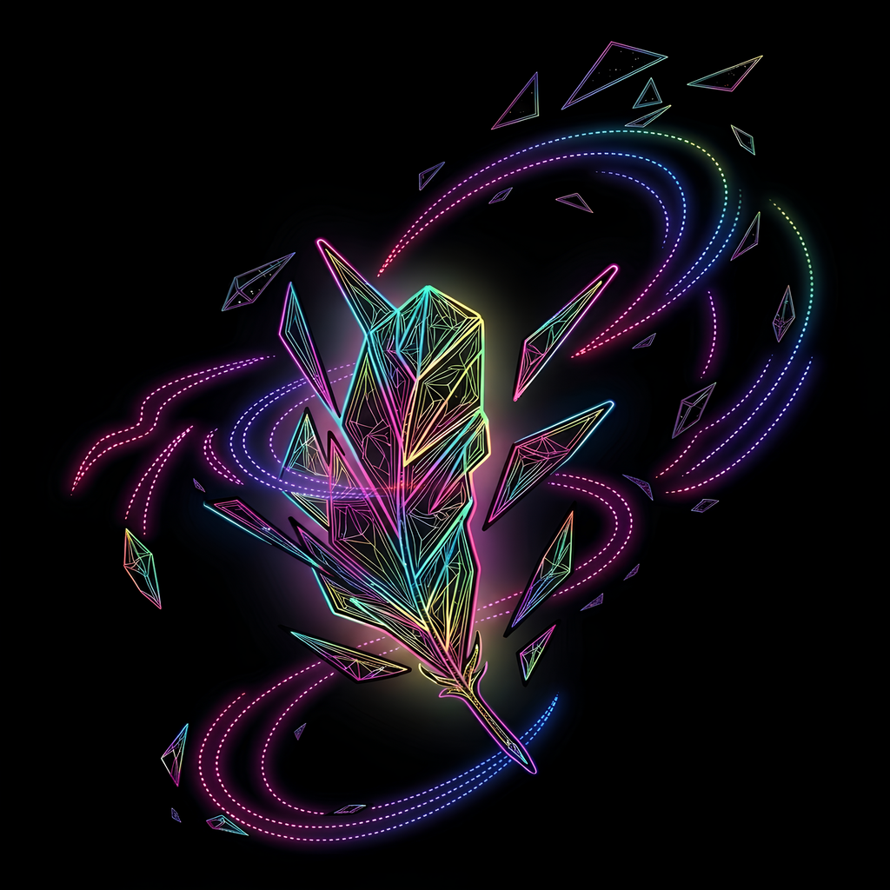

<div align="center">



# ✨ Lumineria Launcher

**Launcher personalizado de Minecraft para la comunidad y servidores de Lumineria**


[Reportar un bug](https://github.com/Duk3lo/lumineria_launcher/issues) · [Solicitar una función](https://github.com/Duk3lo/lumineria_launcher/issues)

</div>

---

## 📖 Sobre el proyecto

**Lumineria Launcher** es un launcher de Minecraft hecho a medida para la comunidad y los servidores de **Lumineria**. Está construido con **Tauri** (backend en Rust) y **JavaScript vanilla** en el frontend, sin frameworks, priorizando un launcher ligero, rápido y fácil de mantener.

El objetivo es darle a la comunidad una forma simple de jugar en los servidores de Lumineria sin complicarse con instalaciones manuales de mods, versiones de Java o configuraciones de Minecraft.

## 🚀 Características

- 🧩 **Gestión de instancias/perfiles**: cada perfil define su propio loader, versión de Minecraft, versión de Java y mods (vía packwiz).
- 👤 **Inicio de sesión offline**: acceso mediante nombre de usuario, sin necesidad de cuenta premium.
- 🔑 **Inicio de sesión con Microsoft** *(en desarrollo)*: soporte para cuentas premium.
- 💾 **Persistencia de sesión y configuración**: recuerda tu sesión y tus ajustes (RAM, argumentos de Java) entre reinicios.
- 🔄 **Autoactualización** *(en desarrollo)*: el launcher se actualizará automáticamente para todos los usuarios.
- 🖥️ Interfaz ligera, construida sin frameworks pesados.

> Los ítems marcados como *(en desarrollo)* aún están en construcción.

## 🛠️ Tecnologías

| Parte      | Tecnología                     |
|------------|---------------------------------|
| Backend    | [Rust](https://www.rust-lang.org/) + [Tauri](https://tauri.app/) |
| Frontend   | HTML, CSS y JavaScript Vanilla |
| Empaquetado| GitHub Actions → instalador MSI (WiX) para Windows |

## 📦 Instalación (desarrollo)

### Requisitos previos

- [Node.js](https://nodejs.org/)
- [Rust](https://www.rust-lang.org/tools/install)
- [Tauri CLI](https://tauri.app/v1/guides/getting-started/prerequisites)

### Pasos

```bash
# Clonar el repositorio
git clone https://github.com/Duk3lo/lumineria_launcher.git
cd lumineria_launcher

# Ejecutar en modo desarrollo
cargo tauri dev
```

### Compilar para producción

```bash
cargo tauri build
```

El instalador generado quedará disponible en `src-tauri/target/release/bundle/`.

## 🤝 Contribuir

Las contribuciones son bienvenidas. Si quieres colaborar:

1. Haz un fork del proyecto.
2. Crea una rama para tu función (`git checkout -b feature/nueva-funcion`).
3. Haz commit de tus cambios (`git commit -m 'Agrega nueva función'`).
4. Sube tu rama (`git push origin feature/nueva-funcion`).
5. Abre un Pull Request.

## 📜 Licencia

Este proyecto usa una licencia dual, similar al esquema que usa Firefox para su código y su marca:

- El **código fuente** del launcher está disponible bajo la licencia **[GPL-3.0-only](https://www.gnu.org/licenses/gpl-3.0.html)**. Esto significa que cualquiera puede usar, estudiar, modificar y redistribuir el código, siempre que las versiones derivadas también se distribuyan bajo GPL-3.0 y se mantenga el aviso de licencia original.
- El **logo y los assets visuales** (branding de Lumineria) están bajo la licencia **[CC BY-SA 4.0](https://creativecommons.org/licenses/by-sa/4.0/)**, por lo que se pueden compartir y adaptar dando el crédito correspondiente y bajo la misma licencia.

Consulta el archivo [`LICENSE`](./LICENSE) para el texto completo de la licencia del código.

---

<div align="center">

Hecho con 💜 para la comunidad de **Lumineria**

</div>